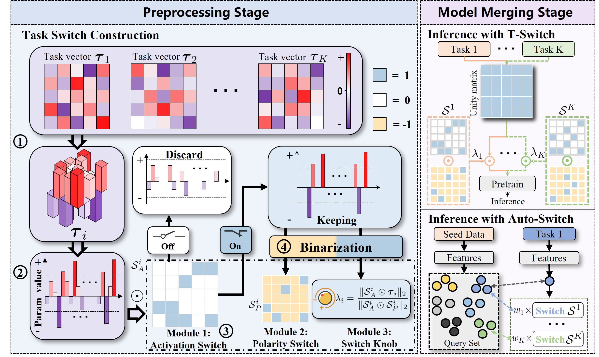

<div align="center">
   
## Less is More: Efficient Model Merging with Binary Task Switch
🏆 **CVPR 2025 Highlight Paper**  

[](https://arxiv.org/abs/2412.00054)

_Biqing Qi <sup>1</sup>, Fangyuan Li <sup>2</sup>, Zhen Wang <sup>3</sup>, Junqi Gao <sup>1,3,†</sup>, Dong Li <sup>1,3</sup>, Peng Ye <sup>1</sup>, Bowen Zhou <sup>1,4,†</sup>_

<sup>1</sup> _Shanghai Artificial Intelligence Laboratory_

<sup>2</sup> _Department of Control Science and Engineering, Harbin Institute of Technology_

<sup>3</sup> _School of Mathematics, Harbin Institute of Technology_

<sup>4</sup> _Department of Electronic Engineering, Tsinghua University_

_<sup>†</sup> Corresponding Authors_



</div>

### ✨ Abstract
As an effective approach to equip models with multi-task capabilities without additional training, model merging has garnered significant attention. However, existing merging methods face challenges of redundant parameter conflicts and the excessive storage burden of fine-tuned parameters. In this work, through controlled experiments, we reveal that for fine-tuned task vectors, only those parameters with magnitudes above a certain threshold contribute positively to the task, exhibiting a pulse-like characteristic. We then attempt leveraging this pulse-like characteristic to binarize the task vectors and reduce storage overhead. Further controlled experiments show that the binarized task vectors incur almost no decrease in fine-tuning and merging performance, and even exhibit stronger performance improvements as the proportion of redundant parameters increases. Based on these insights, we propose Task Switch (T-Switch), which decomposes task vectors into three components: 1) an activation switch instantiated by a binarized mask vector, 2) a polarity switch instantiated by a binarized sign vector, and 3) a scaling knob instantiated by a scalar coefficient. By storing task vectors in a binarized form, T-Switch alleviates parameter conflicts while ensuring efficient task parameter storage. Furthermore, to enable automated switch combination in T-Switch, we further introduce Auto-Switch, which enables training-free switch combination via retrieval from a small query set. Experiments indicate that our methods achieve significant performance improvements over existing baselines, requiring only 1-3$\%$ of the storage space of full-precision parameters.

### 🚀 Quick Start

Try merging ViT models, click [here](./merge_vit/README.md)

Try merging Roberta models, click [here](./merge_lm/README.md)

### 📚 Citation
```
@inproceedings{qi2025less,
  title={Less is more: Efficient model merging with binary task switch},
  author={Qi, Biqing and Li, Fangyuan and Wang, Zhen and Gao, Junqi and Li, Dong and Ye, Peng and Zhou, Bowen},
  booktitle={Proceedings of the Computer Vision and Pattern Recognition Conference},
  pages={15265--15274},
  year={2025}
}
```

# Acknowledgement

Our implementation references the code below, thanks to them.

EMR-Merging: https://github.com/harveyhuang18/EMR_Merging

FusionBench: https://github.com/tanganke/fusion_bench/tree/main/fusion_bench/method

Task Arithmetic: https://github.com/mlfoundations/task_vectors

TIES-MERGING: https://github.com/prateeky2806/ties-merging/tree/main

DARE: https://github.com/yule-BUAA/MergeLM

Adamerging: https://github.com/EnnengYang/AdaMerging?tab=readme-ov-file#datasets


